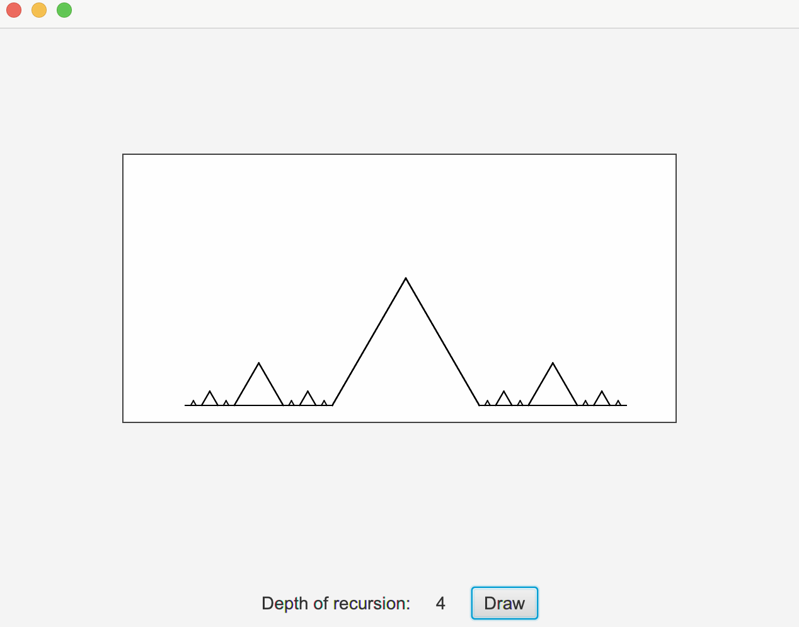

# Fractals Demo

This is a JavaFX application that I created for a tutoring session. It shows how recursion can be implemented using the example of calculating and drawing fractals.

## Starting app
The application can be started by running App.java.

